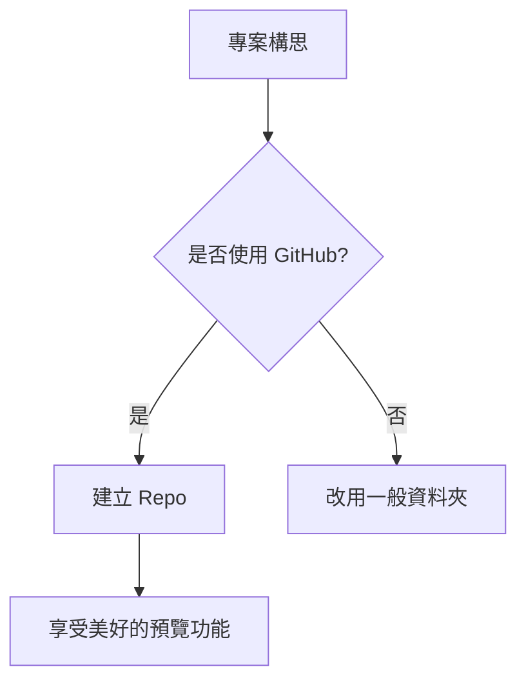
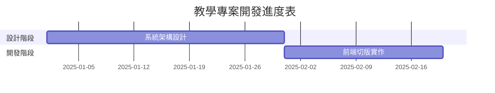

# Mermaid 圖表展示

在 GitHub 上的 Markdown 檔案中，只要標註 `mermaid` 語法，就能自動產生高解析度的圖表！以下是根據教學文件提取的實際示範：

## 1. 簡單流程圖 (Flowchart)

```mermaid
graph TD;
    A[專案構思] --> B{是否使用 GitHub?};
    B -- 是 --> C[建立 Repo];
    B -- 否 --> D[改用一般資料夾];
    C --> E[享受美好的預覽功能];
```

## 2. 開發甘特圖 (Gantt Chart)

```mermaid
gantt
    title 教學專案開發進度表
    dateFormat  YYYY-MM-DD
    section 設計階段
    系統架構設計     :a1, 2025-01-01, 30d
    section 開發階段
    前端切版實作     :after a1, 20d
```
